# MedSecure Health AWS Foundations

## Overview of Medsecure Health 

MedSecure Health is a fictional healthcare Software-as-a-Service (SaaS) company that provides secure digital healthcare solutions for clinics, healthcare providers, and patients.
The platform offers services including:
- Patient record management
- Appointment scheduling
- Telehealth consultations
- Medical document storage
- Healthcare staff administration
Because MedSecure Health handles sensitive patient information, security, availability, and auditability are critical requirements. This project focuses on building a secure AWS foundation that can support healthcare workloads while following cloud security best practices.

## Project Goals

The goal of this project is to design and deploy a secure AWS environment for MedSecure Health.
Objectives include:
- Create a secure network architecture using Amazon VPC
- Deploy a web application server using Amazon EC2
- Configure secure storage using Amazon S3
- Implement Identity and Access Management (IAM) following the principle of least privilege
- Enable logging and auditing using AWS CloudTrail
- Configure Security Groups to restrict network access
- Document security decisions and threat mitigations
- Establish a foundation for future security monitoring and automation projects
This project represents the initial cloud infrastructure deployment for MedSecure Health.

## Architecture Summary

The environment consists of a custom VPC (10.0.0.0/16) containing a public subnet that hosts an Amazon Linux EC2 instance. Internet connectivity is provided through an Internet Gateway and public route table. Access is controlled using Security Groups, IAM, and MFA. AWS CloudTrail captures account activity and stores audit logs in Amazon S3.

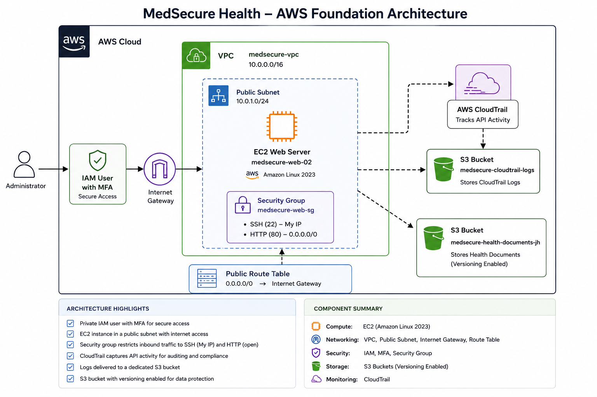

## Implementation Evidence

### IAM and MFA

- IAM administrative user created
- MFA enabled for console access

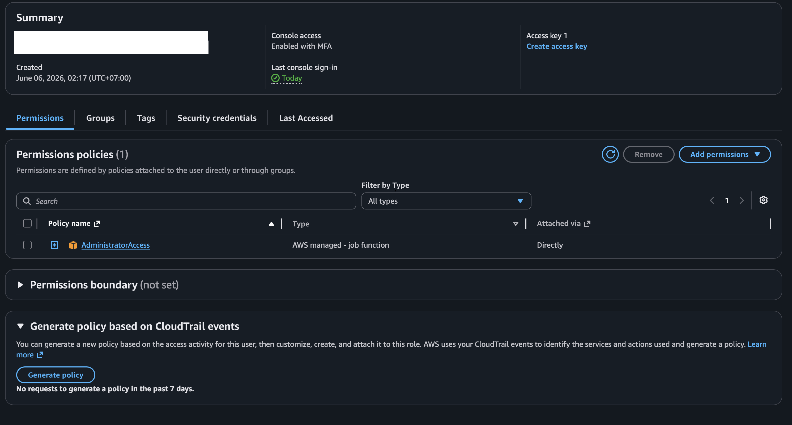

### Network Infrastructure
- Custom VPC created
- Public subnet configured
- Internet Gateway attached
- Public route table configured

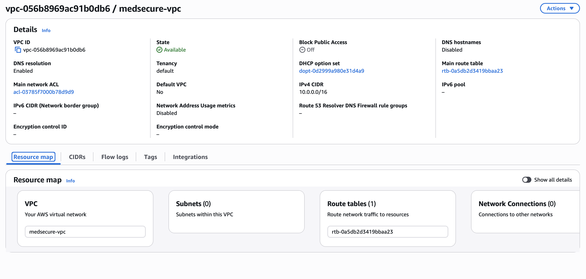

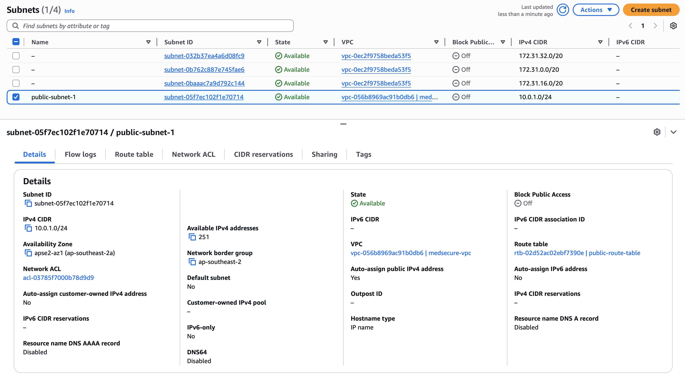

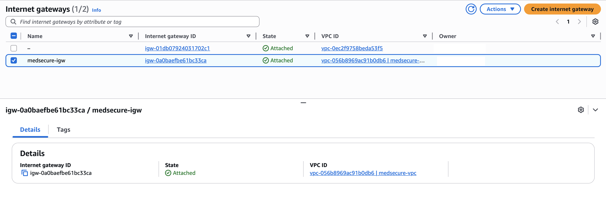

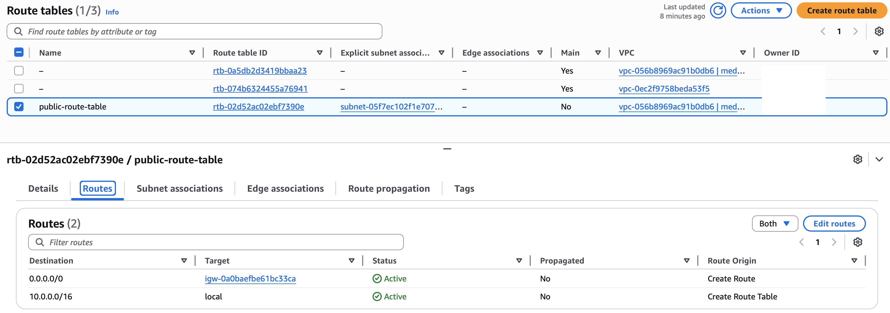

### EC2 Web Server
- Amazon Linux EC2 instance deployed
- Security group configured with HTTP and SSH access
- Instance successfully reached running state
- SSH access restricted to My IP for administrative access

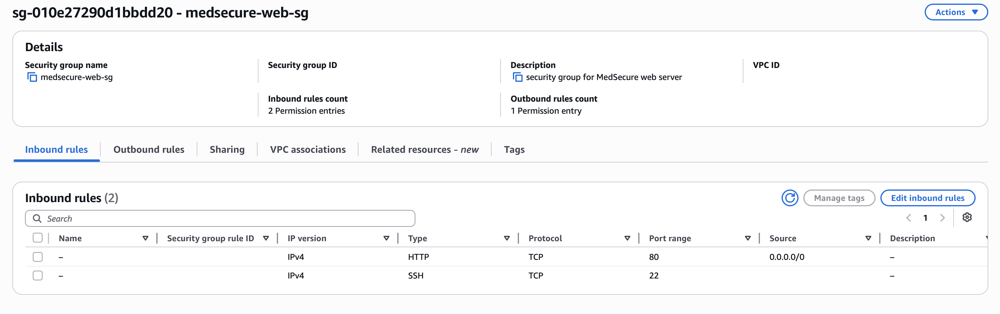

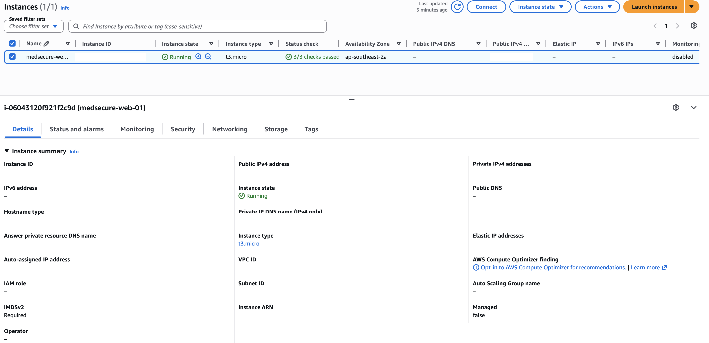

### Storage and Logging
- S3 bucket created for CloudTrail logs
- CloudTrail enabled
- Event history validated

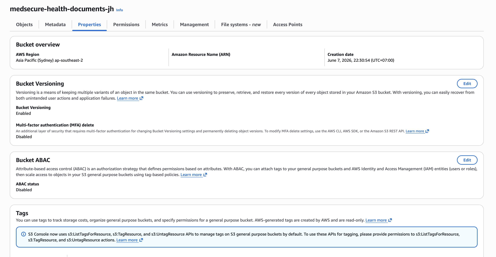

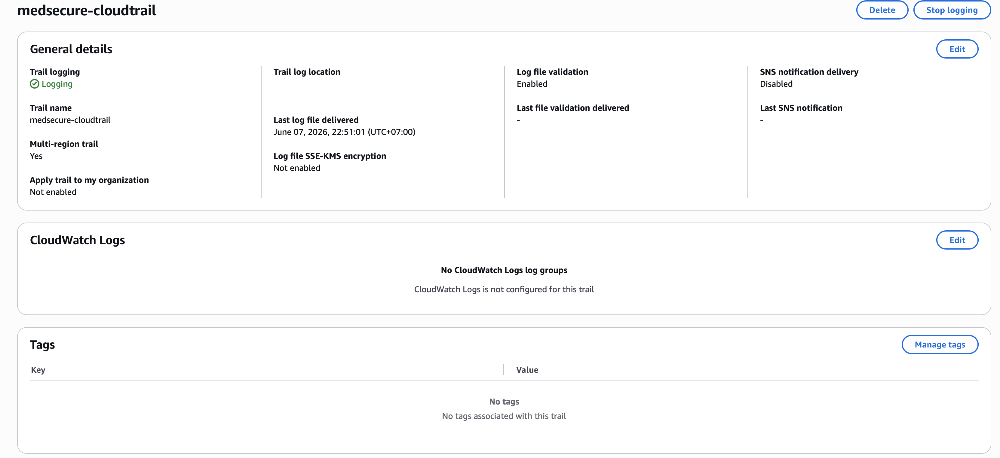

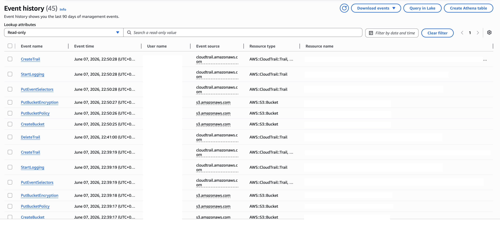

## AWS Services Used

- Amazon VPC
- Amazon EC2
- Amazon S3
- AWS IAM
- AWS CloudTrail
- Security Groups
- Internet Gateway
- Route Tables
- Subnets

## Security Controls Implemented

- Multi-Factor Authentication (MFA) enabled for IAM user access
- Administrative access separated from root account usage
- Security Group configured with HTTP access and restricted SSH access
- CloudTrail enabled for account activity auditing
- CloudTrail logs stored in Amazon S3
- S3 bucket versioning enabled for data protection
- Principle of Least Privilege applied to network access controls

## Lessons Learned

- Learned how AWS IAM and MFA improve account security and reduce the risk of unauthorized access.
- Gained hands-on experience designing a custom VPC with public networking components.
- Configured security groups using the principle of least privilege and restricted SSH access to My IP.
- Troubleshot EC2 Instance Connect connectivity issues related to inbound source IP filtering.
- Implemented centralized logging and auditing using AWS CloudTrail and Amazon S3.
- Improved understanding of AWS networking concepts including subnets, route tables, and Internet Gateways.
