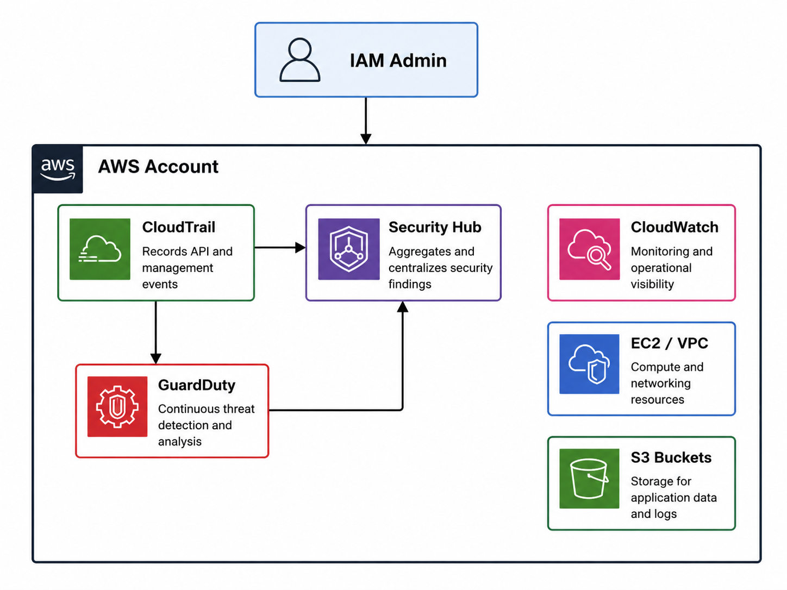

# MedSecure Health Security Monitoring

## Project Overview

This project demonstrates the implementation of AWS-native security monitoring services for a fictional healthcare SaaS company, MedSecure Health.

The environment was designed to improve visibility into AWS account activity, identify security risks, investigate findings, and establish incident response procedures using AWS-native security services.

## Business Scenario

MedSecure Health is a fictional healthcare SaaS company that manages patient records, appointment scheduling, telehealth services, and medical document storage.

Because the organization handles sensitive healthcare information, continuous monitoring, threat detection, and security visibility are critical business requirements.

## Security Objectives

- Continuous threat detection
- Centralized security findings
- Log monitoring
- Incident response preparation

## Security Controls Implemented

- Continuous threat detection with GuardDuty
- Centralized security findings through Security Hub
- API activity logging with CloudTrail
- Security posture assessments using AWS Foundational Security Best Practices
- Incident response planning and documentation
- Audit log investigation and event analysis

## AWS Services Used

- Amazon GuardDuty
- AWS Security Hub
- AWS CloudTrail
- Amazon CloudWatch
- AWS IAM
- Amazon S3
- Amazon EC2
- Amazon VPC

## Architecture Diagram

The following diagram illustrates the security monitoring architecture implemented for MedSecure Health.

CloudTrail collects API and management events across the AWS account. GuardDuty analyzes activity for potential threats and Security Hub aggregates findings into a centralized dashboard. CloudWatch provides monitoring and operational visibility across the environment.

## Security Monitoring Capabilities

Implemented:

- Amazon GuardDuty
- AWS Security Hub
- AWS CloudTrail
- Security findings analysis
- Incident response planning
- Security event investigation

## Security Findings Analysis

Security Hub findings were reviewed and analyzed to identify potential security risks within the AWS environment.

Key findings investigated included:

- VPC default security group configurations
- Automatic public IP assignment in subnets
- S3 bucket SSL enforcement

Each finding was documented with associated risks, investigation steps, and remediation recommendations.

## Lessons Learned

- Security monitoring requires both detection and investigation capabilities.
- CloudTrail provides critical visibility into AWS account activity and administrative actions.
- Security Hub simplifies security posture management by centralizing findings from multiple AWS services.
- GuardDuty enhances threat detection through continuous analysis of AWS activity.
- Incident response planning is as important as technical security controls.
- Effective cloud security requires ongoing monitoring, documentation, and remediation efforts.